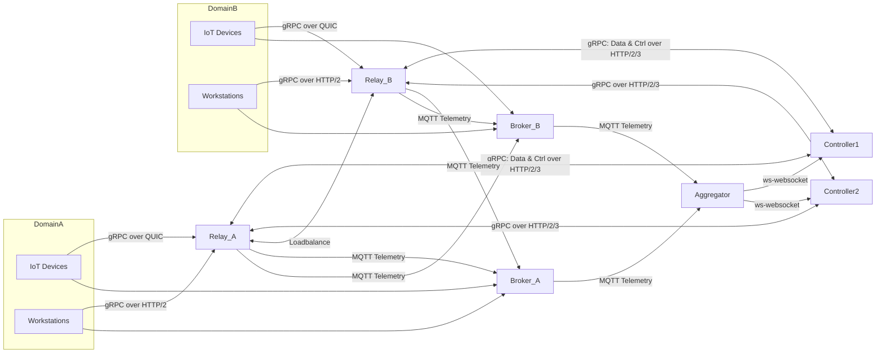

## Full System Overview

```mermaid
flowchart LR
  subgraph DomainA
    direction LR
    IoT_A[IoT Devices]
    WS_A[Workstations]
  end
  subgraph DomainB
    direction LR
    IoT_B[IoT Devices]
    WS_B[Workstations]
  end

  IoT_A -->|gRPC over QUIC| Relay_A
  IoT_A --> Broker_A
  WS_A -->|gRPC over HTTP/2| Relay_A
  WS_A --> Broker_A

  IoT_B --> |gRPC over QUIC| Relay_B
  IoT_B --> Broker_B
  WS_B --> |gRPC over HTTP/2| Relay_B
  WS_B --> Broker_B

  Relay_A <-->|gRPC: Data & Ctrl over HTTP/2/3| Controller1
  Relay_B <-->|gRPC: Data & Ctrl over HTTP/2/3| Controller1
  Relay_A <-->|gRPC over HTTP/2/3| Controller2
  Relay_B <-->|gRPC over HTTP/2/3| Controller2

  Relay_A <-->|Loadbalance| Relay_B

  Relay_A -->|MQTT Telemetry| Broker_A
  Relay_A -->|MQTT Telemetry| Broker_B
  Relay_B -->|MQTT Telemetry| Broker_A
  Relay_B -->|MQTT Telemetry| Broker_B

  Broker_A -->|MQTT Telemetry| Aggregator
  Broker_B -->|MQTT Telemetry| Aggregator

  Aggregator -->|ws-websocket| Controller1
  Aggregator -->|ws-websocket| Controller2
```