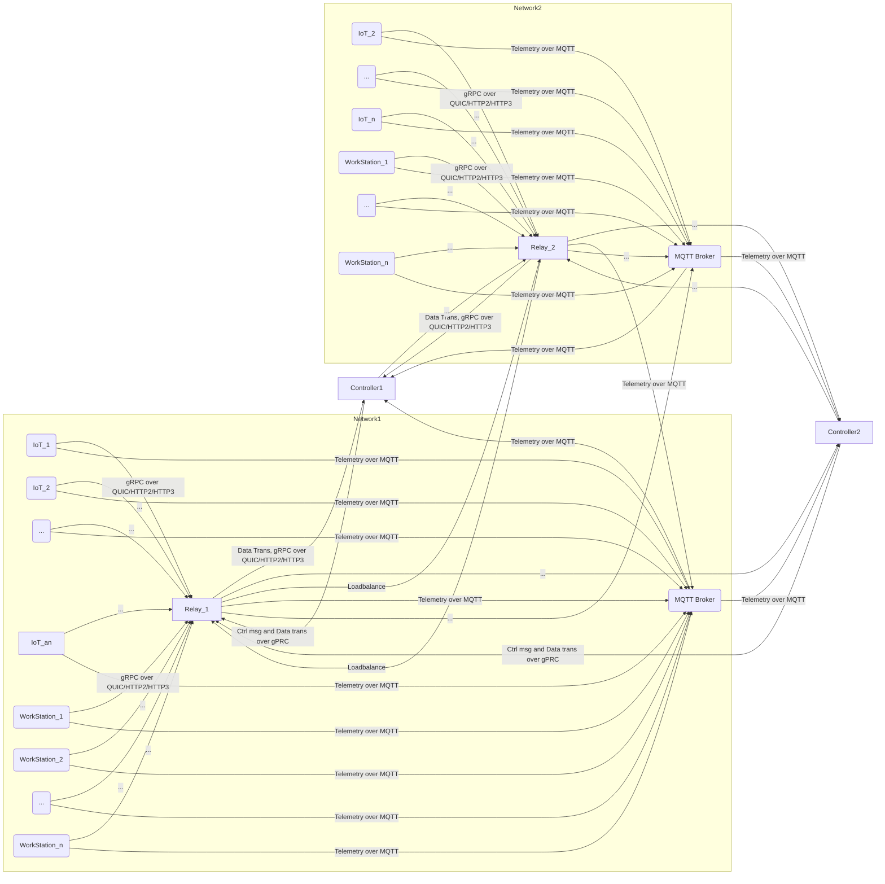

# gRPC-Relay 系统需求规格说明书 v2.1

## 1. 概述

### 1.1 系统目标
gRPC-Relay 实现跨网域的 gRPC 通信中继，使处于内网（无公网 IP）的设备能够被外部控制端安全、高效地访问和管理。

### 1.2 使用场景
- **跨网域设备管理**：Controller 位于公网或办公网，需要管理分布在不同内网的 IoT 设备和工作站
- **双向数据传输**：支持控制命令下发和数据文件上传
- **动态设备发现**：设备上下线时，Controller 能够实时感知并建立连接

### 1.3 非目标（明确不做什么）
- **不做设备端业务逻辑**：Relay 不理解具体业务语义，只负责中继
- **不做数据存储**：Relay 不持久化业务数据，只做流式转发
- **不做内容级审计**：只记录调用关系元数据，不记录加密的 payload 内容
- **首版不做多 Relay 集群**：先验证单节点可行性，后续版本再实现负载均衡和高可用

---

## 2. 术语定义

### 2.1 核心角色

| 角色 | 定义 | 职责 |
|------|------|------|
| **Device** | 物理设备，可能是 IoT 设备、工作站或其他计算设备 | 运行 stationService，执行业务逻辑 |
| **stationService** | 运行在 Device 上的代理进程 | 与 Relay 保持长连接，接收控制命令，上报遥测数据 |
| **Controller** | 具有人机交互功能的管理控制系统 | 发现设备、发起连接、发送控制命令、接收数据 |
| **Relay** | 中继服务器 | 管理设备长连接，转发 gRPC 流量，提供服务发现接口 |
| **MQTT Broker** | 消息代理服务器 | 传输遥测数据和设备上下线通知 |

### 2.2 关键概念

| 概念 | 定义 |
|------|------|
| **device_id** | 设备的全局唯一标识符，基于设备名称、MAC 地址或序列号生成 |
| **connection_id** | Relay 为每个活跃连接分配的会话标识符，绑定到 device_id |
| **session** | 从设备连接建立到断开的完整生命周期 |
| **stream** | gRPC 双向流，用于传输控制命令和数据 |
| **endpoint** | 设备在 Relay 上的访问端点信息，包括 connection_id、relay_address、timestamp 等 |

---

## 3. 架构选择

### 3.1 透明性 vs 可控性权衡

**选择：可控中继模式**

- **Relay 可见元数据**：
  - `device_id`：设备标识
  - `controller_id`：控制端标识
  - `method_name`：gRPC 方法名
  - `timestamp`：请求时间戳
  - `stream_id`：流标识

- **Relay 不可见内容**：
  - 业务 payload 采用端到端加密（设备与 Controller 之间）
  - Relay 无法解密业务数据

- **授权和审计**：
  - 授权基于元数据（device_id、controller_id、method_name）
  - 审计记录调用关系，不记录加密内容

**理由**：
- 满足安全合规要求（端到端加密）
- 保留必要的可控性（授权、审计、限流）
- 避免 Relay 成为安全单点

### 3.2 协议选择和分层

| 链路 | 协议 | 说明 |
|------|------|------|
| **Device ↔ Relay** | gRPC over QUIC | 长连接，利用 QUIC 的低延迟和连接迁移特性 |
| **Controller ↔ Relay** | gRPC over HTTP/2（首版）<br>可选 QUIC（后续） | 首版使用成熟的 HTTP/2，后续可升级 QUIC |
| **遥测数据传输** | MQTT | 设备、Relay 向 MQTT Broker 发布遥测数据 |
| **服务发现** | MQTT（通知为主）<br>gRPC 查询接口（辅助） | 设备上下线通过 MQTT 通知，Controller 可通过 gRPC 查询在线设备列表 |
| **降级策略** | TLS/TCP | QUIC 不可用时自动降级到 TLS over TCP |

**MQTT Broker 部署**：独立部署，与 Relay 解耦，便于扩展和维护。

### 3.3 网络拓扑

参考补充文档中的流程图，见 [第17节 系统数据和遥测流图](#section17)，系统支持：
- 多个网域（Network1, Network2, ...）
- 每个网域内有多个 Device 和一个 Relay
- 多个 Controller 可连接到多个 Relay
- 所有 Relay 和 Device 向 MQTT Broker 发布遥测数据

---

## 4. 核心流程

### 4.1 设备注册和上线

```
1. Device 启动，stationService 自启动
2. stationService 向 Relay 发起 gRPC 连接（over QUIC）
3. Relay 验证设备身份（基于设备证书或预置 Token）
4. 连接成功后，Relay 分配 connection_id，绑定到 device_id
5. Relay 向 MQTT Broker 发布设备上线消息：
   Topic: relay/device/online
   Payload: {
     "device_id": "device-001",
     "connection_id": "conn-12345",
     "relay_address": "relay1.example.com:50051",
     "timestamp": "2025-01-15T10:30:00Z",
     "metadata": {
       "region": "us-west",
       "device_type": "iot-sensor"
     }
   }
6. stationService 也向 MQTT Broker 发布自身遥测数据（可选，作为备份验证）
```

### 4.2 心跳和保活

```
1. stationService 每 30 秒通过 gRPC 流发送心跳消息
2. Relay 更新设备的 last_seen 时间戳
3. 如果 120 秒内未收到心跳，Relay 标记设备为"疑似离线"
4. 如果 300 秒内未收到心跳，Relay 关闭连接，发布设备离线消息
```

### 4.3 Controller 发现设备

**方案：三种方式互为备份和验证**

#### 方案 1：stationService 通过 MQTT 上报连接信息
- **优点**：
  - 设备自主上报，信息最准确
  - 减轻 Relay 负担
  - Controller 可直接订阅 MQTT 获取实时通知
- **缺点**：
  - 依赖设备侧 MQTT 客户端稳定性
  - 如果设备 MQTT 连接失败，Controller 无法感知设备上线
  - 需要设备侧额外实现 MQTT 逻辑

#### 方案 2：Relay 通过 MQTT 上报连接信息
- **优点**：
  - Relay 集中管理，信息一致性高
  - 设备侧无需实现 MQTT 逻辑，简化设备代码
  - Relay 可以聚合多个设备的状态变化，批量发布
- **缺点**：
  - Relay 成为单点，如果 Relay 的 MQTT 连接失败，通知丢失
  - Relay 负担增加

#### 方案 3：Controller 查询 Relay
- **优点**：
  - 主动查询，不依赖 MQTT 通知
  - 可以获取实时的设备列表和状态
  - 适合 Controller 启动时的全量同步
- **缺点**：
  - 无法实时感知设备上下线（需要轮询）
  - 增加 Relay 的查询负担

**推荐实现：三种方式都实现，互为备份和验证**

```
1. Relay 通过 MQTT 发布设备上下线通知（主要方式）
   - Topic: relay/device/online, relay/device/offline
   - 保证信息一致性和及时性

2. stationService 通过 MQTT 发布自身状态（备份验证）
   - Topic: device/{device_id}/status
   - Controller 可以对比 Relay 和 Device 的上报信息，检测不一致

3. Controller 通过 gRPC 查询 Relay（辅助方式）
   - RPC: ListOnlineDevices()
   - 用于 Controller 启动时的全量同步，或 MQTT 通知丢失时的补偿查询

4. 验证机制：
   - Controller 收到 MQTT 通知后，可以通过 gRPC 查询 Relay 验证设备是否真的在线
   - 如果发现不一致，记录告警日志
```

### 4.4 Controller 发起会话

```
1. Controller 从 MQTT 或 gRPC 查询获取设备的 endpoint 信息
2. Controller 向 Relay 发起 gRPC 连接，指定目标 device_id
3. Relay 验证 Controller 身份和权限（基于 Token 或证书）
4. Relay 检查 Controller 是否有权限访问目标设备（基于 RBAC）
5. 权限验证通过后，Relay 在 Controller 和 Device 之间建立流映射
6. Relay 开始转发双向流数据
```

### 4.5 数据中继

```
1. Controller 发送 gRPC 请求 → Relay
2. Relay 提取元数据（device_id, method_name, timestamp）
3. Relay 记录审计日志（不记录加密 payload）
4. Relay 将请求转发到目标 Device
5. Device 处理请求，返回响应 → Relay
6. Relay 转发响应到 Controller
7. 整个过程中，Relay 只做字节流转发，不解密 payload
```

### 4.6 设备重连和会话恢复

```
1. 设备网络中断，连接断开
2. stationService 检测到断连，启动重连逻辑（指数退避）
3. 重连成功后，stationService 发送恢复请求，携带：
   - device_id
   - 上一次的 connection_id（如果有）
   - 序列号（用于去重）
4. Relay 检查是否存在未完成的流：
   - 如果存在且未超时，尝试恢复流映射
   - 如果已超时或不存在，创建新会话
5. Relay 返回新的 connection_id
6. Relay 发布设备重新上线消息到 MQTT
```

**幂等性保证**：
- 每个请求携带全局唯一的序列号（sequence_number）
- Relay 维护最近 N 个已处理序列号的缓存（如 10000 个）
- 收到重复序列号的请求时，直接返回缓存的响应，不重复转发

### 4.7 设备离线和清理

```
1. 设备正常关闭：stationService 发送断开请求，Relay 立即清理会话
2. 设备异常断开：Relay 在 300 秒超时后清理会话
3. Relay 发布设备离线消息到 MQTT：
   Topic: relay/device/offline
   Payload: {
     "device_id": "device-001",
     "connection_id": "conn-12345",
     "timestamp": "2025-01-15T11:00:00Z",
     "reason": "timeout" | "graceful_shutdown" | "error"
   }
4. Relay 关闭与该设备相关的所有流
5. 如果有 Controller 正在与该设备通信，Relay 返回错误：DEVICE_OFFLINE
```

---

## 5. 接口定义

### 5.1 gRPC Service 定义

```protobuf
syntax = "proto3";

package relay.v1;

// Relay 提供的服务
service RelayService {
  // 设备注册和保持长连接
  rpc DeviceConnect(stream DeviceMessage) returns (stream RelayMessage);
  
  // Controller 查询在线设备列表
  rpc ListOnlineDevices(ListOnlineDevicesRequest) returns (ListOnlineDevicesResponse);
  
  // Controller 与设备建立通信流
  rpc ConnectToDevice(stream ControllerMessage) returns (stream DeviceResponse);
}

// 设备消息
message DeviceMessage {
  string device_id = 1;
  string token = 2;  // 认证 Token
  
  oneof payload {
    RegisterRequest register = 10;
    HeartbeatRequest heartbeat = 11;
    DataResponse data = 12;
  }
}

// 设备注册请求
message RegisterRequest {
  string device_id = 1;
  map<string, string> metadata = 2;  // region, device_type 等
  string previous_connection_id = 3;  // 用于会话恢复
}

// 心跳请求
message HeartbeatRequest {
  string connection_id = 1;
  int64 timestamp = 2;
}

// Relay 消息
message RelayMessage {
  oneof payload {
    RegisterResponse register_response = 10;
    HeartbeatResponse heartbeat_response = 11;
    DataRequest data_request = 12;
  }
}

// 注册响应
message RegisterResponse {
  string connection_id = 1;
  bool session_resumed = 2;
  int64 timestamp = 3;
}

// 心跳响应
message HeartbeatResponse {
  int64 timestamp = 1;
}

// Controller 消息
message ControllerMessage {
  string controller_id = 1;
  string token = 2;  // 认证 Token
  string target_device_id = 3;
  string method_name = 4;  // gRPC 方法名（元数据）
  int64 sequence_number = 5;  // 序列号，用于幂等性
  bytes encrypted_payload = 6;  // 端到端加密的业务数据
}

// 设备响应
message DeviceResponse {
  string device_id = 1;
  int64 sequence_number = 2;
  bytes encrypted_payload = 3;
  ErrorCode error = 4;
}

// 查询在线设备请求
message ListOnlineDevicesRequest {
  string controller_id = 1;
  string token = 2;
  string region_filter = 3;  // 可选，按区域过滤
}

// 查询在线设备响应
message ListOnlineDevicesResponse {
  repeated DeviceInfo devices = 1;
}

message DeviceInfo {
  string device_id = 1;
  string connection_id = 2;
  string relay_address = 3;
  int64 connected_at = 4;
  map<string, string> metadata = 5;
}

// 错误码
enum ErrorCode {
  OK = 0;
  DEVICE_OFFLINE = 1;
  UNAUTHORIZED = 2;
  DEVICE_NOT_FOUND = 3;
  RATE_LIMITED = 4;
  INTERNAL_ERROR = 5;
}
```

### 5.2 MQTT 主题和消息格式

#### 设备上线通知
```
Topic: relay/device/online
QoS: 1 (至少一次)
Payload (JSON):
{
  "device_id": "device-001",
  "connection_id": "conn-12345",
  "relay_address": "relay1.example.com:50051",
  "timestamp": "2025-01-15T10:30:00Z",
  "metadata": {
    "region": "us-west",
    "device_type": "iot-sensor"
  }
}
```

#### 设备离线通知
```
Topic: relay/device/offline
QoS: 1
Payload (JSON):
{
  "device_id": "device-001",
  "connection_id": "conn-12345",
  "timestamp": "2025-01-15T11:00:00Z",
  "reason": "timeout" | "graceful_shutdown" | "error"
}
```

#### 设备自身状态上报（备份验证）
```
Topic: device/{device_id}/status
QoS: 1
Payload (JSON):
{
  "device_id": "device-001",
  "status": "online" | "offline",
  "relay_address": "relay1.example.com:50051",
  "connection_id": "conn-12345",
  "timestamp": "2025-01-15T10:30:00Z"
}
```

#### 遥测数据
```
Topic: telemetry/{device_id}
QoS: 0 (最多一次，遥测数据允许丢失)
Payload (JSON):
{
  "device_id": "device-001",
  "timestamp": "2025-01-15T10:30:00Z",
  "metrics": {
    "cpu_usage": 45.2,
    "memory_usage": 60.5,
    "network_rx_bytes": 1024000,
    "network_tx_bytes": 512000
  }
}
```

#### **Relay 遥测数据**
```
Topic: telemetry/relay/{relay_id}
QoS: 0 (最多一次)
Payload (JSON):
{
  "relay_id": "relay-001",
  "relay_address": "relay1.example.com:50051",
  "timestamp": "2025-01-15T10:30:00Z",
  "system_metrics": {
    "cpu_usage_percent": 45.2,
    "memory_usage_percent": 60.5,
    "memory_used_bytes": 1288490188,
    "memory_total_bytes": 2147483648,
    "disk_usage_percent": 35.0,
    "disk_used_bytes": 10737418240,
    "disk_total_bytes": 30720000000,
    "network_rx_bytes_per_sec": 10485760,
    "network_tx_bytes_per_sec": 5242880,
    "open_file_descriptors": 1024,
    "max_file_descriptors": 65536,
    "goroutines": 512,
    "uptime_seconds": 86400
  },
  "connection_metrics": {
    "total_device_connections": 8523,
    "total_controller_connections": 156,
    "active_device_connections": 8500,
    "active_controller_connections": 150,
    "device_connections_by_region": {
      "us-west": 3200,
      "us-east": 2800,
      "eu-central": 1500,
      "ap-southeast": 1000
    },
    "device_connections_by_type": {
      "iot-sensor": 6000,
      "workstation": 2500
    },
    "connection_rate_per_min": 12,
    "disconnection_rate_per_min": 8,
    "failed_auth_rate_per_min": 2
  },
  "stream_metrics": {
    "total_active_streams": 1024,
    "streams_by_method": {
      "ExecuteCommand": 512,
      "TransferFile": 256,
      "QueryStatus": 256
    },
    "stream_creation_rate_per_min": 50,
    "stream_completion_rate_per_min": 48,
    "stream_error_rate_per_min": 2
  },
  "performance_metrics": {
    "avg_relay_latency_ms": 3.5,
    "p50_relay_latency_ms": 2.8,
    "p95_relay_latency_ms": 8.2,
    "p99_relay_latency_ms": 15.6,
    "avg_throughput_mbps": 125.5,
    "peak_throughput_mbps": 450.0,
    "requests_per_second": 5000,
    "bytes_relayed_per_second": 15728640
  },
  "error_metrics": {
    "total_errors_per_min": 5,
    "errors_by_code": {
      "DEVICE_OFFLINE": 2,
      "UNAUTHORIZED": 1,
      "RATE_LIMITED": 1,
      "INTERNAL_ERROR": 1
    },
    "connection_timeout_count": 3,
    "stream_error_count": 2
  },
  "queue_metrics": {
    "pending_messages_to_devices": 128,
    "pending_messages_to_controllers": 64,
    "max_queue_depth": 10000,
    "queue_overflow_count": 0,
    "avg_queue_wait_time_ms": 5.2
  },
  "mqtt_metrics": {
    "mqtt_connected": true,
    "mqtt_publish_rate_per_sec": 100,
    "mqtt_publish_error_rate_per_sec": 0,
    "mqtt_reconnect_count": 0
  },
  "health_status": {
    "overall_status": "healthy" | "degraded" | "unhealthy",
    "components": {
      "grpc_server": "healthy",
      "quic_listener": "healthy",
      "mqtt_client": "healthy",
      "auth_service": "healthy",
      "metrics_collector": "healthy"
    }
  }
}
```

**Relay 遥测参数说明**：

| 类别 | 参数 | 说明 | 用途 |
|------|------|------|------|
| **系统指标** | `cpu_usage_percent` | CPU 使用率 | 监控资源瓶颈 |
| | `memory_usage_percent` | 内存使用率 | 监控内存压力 |
| | `memory_used_bytes` | 已用内存字节数 | 容量规划 |
| | `network_rx/tx_bytes_per_sec` | 网络收发速率 | 监控带宽使用 |
| | `open_file_descriptors` | 打开的文件描述符数 | 检测连接泄漏 |
| | `goroutines` | Go 协程数（如使用 Go） | 检测协程泄漏 |
| | `uptime_seconds` | 运行时长 | 稳定性监控 |
| **连接指标** | `total_device_connections` | 设备连接总数 | 容量监控 |
| | `active_device_connections` | 活跃设备连接数 | 实时负载 |
| | `device_connections_by_region` | 按区域分组的连接数 | 地域分布分析 |
| | `connection_rate_per_min` | 每分钟新建连接数 | 流量趋势 |
| | `failed_auth_rate_per_min` | 认证失败率 | 安全监控 |
| **流指标** | `total_active_streams` | 活跃流总数 | 并发监控 |
| | `streams_by_method` | 按方法分组的流数 | 业务分析 |
| | `stream_error_rate_per_min` | 流错误率 | 质量监控 |
| **性能指标** | `p50/p95/p99_relay_latency_ms` | 延迟分位数 | SLA 监控 |
| | `avg_throughput_mbps` | 平均吞吐量 | 性能评估 |
| | `requests_per_second` | 每秒请求数 | 负载监控 |
| **错误指标** | `errors_by_code` | 按错误码分组的错误数 | 故障诊断 |
| | `connection_timeout_count` | 连接超时次数 | 网络质量 |
| **队列指标** | `pending_messages_to_devices` | 待发送到设备的消息数 | 背压监控 |
| | `queue_overflow_count` | 队列溢出次数 | 容量告警 |
| | `avg_queue_wait_time_ms` | 平均队列等待时间 | 延迟分析 |
| **MQTT 指标** | `mqtt_connected` | MQTT 连接状态 | 依赖健康检查 |
| | `mqtt_publish_error_rate_per_sec` | MQTT 发布错误率 | 集成监控 |
| **健康状态** | `overall_status` | 整体健康状态 | 快速判断 |
| | `components` | 各组件健康状态 | 细粒度诊断 |

**遥测数据发布频率**：
- 系统指标：每 10 秒
- 连接/流/性能指标：每 30 秒
- 错误指标：每 60 秒
- 健康状态：每 30 秒

### 5.3 错误码清单

| 错误码 | 说明 | Controller 处理建议 |
|--------|------|---------------------|
| `OK` | 成功 | 继续处理 |
| `DEVICE_OFFLINE` | 目标设备离线 | 等待设备上线通知后重试 |
| `UNAUTHORIZED` | 认证失败 | 检查 Token 是否有效，重新认证 |
| `DEVICE_NOT_FOUND` | 设备不存在 | 检查 device_id 是否正确 |
| `RATE_LIMITED` | 请求频率超限 | 指数退避后重试 |
| `INTERNAL_ERROR` | Relay 内部错误 | 记录日志，切换到备用 Relay（如果有） |

---

## 6. 权限模型

### 6.1 认证机制

#### 设备认证
- **方式 1（推荐）**：设备证书（mTLS）
  - 设备出厂时预置证书和私钥
  - Relay 验证证书链和设备 ID
- **方式 2**：预置 Token
  - 设备在注册阶段获取 Token
  - Token 有效期 30 天，支持刷新

#### Controller 认证
- **方式**：JWT Token
  - Controller 通过认证服务获取 JWT
  - JWT 包含 controller_id、角色、权限范围、过期时间
  - Relay 验证 JWT 签名和有效期

### 6.2 授权模型

**采用 RBAC（基于角色的访问控制）+ 设备归属**

#### 角色定义
| 角色 | 权限 |
|------|------|
| `admin` | 可访问所有设备，可执行所有操作 |
| `operator` | 可访问授权的设备，可执行控制命令和数据传输 |
| `viewer` | 可访问授权的设备，只能查询状态，不能执行控制命令 |

#### 设备归属
- 每个设备归属于一个 Project 或 Tenant
- Controller 只能访问其有权限的 Project/Tenant 下的设备

#### 权限检查时机
- **连接建立时**：Relay 检查 Controller 是否有权限访问目标设备
- **不在每次转发时检查**：避免性能开销

#### 权限检查逻辑
```
1. 提取 Controller 的 JWT，获取 controller_id 和角色
2. 查询 Controller 的权限范围（可访问的 Project/Tenant 列表）
3. 查询目标设备的归属（device_id → project_id）
4. 检查：
   - 如果角色是 admin，允许访问
   - 如果设备的 project_id 在 Controller 的权限范围内，允许访问
   - 否则，拒绝访问，返回 UNAUTHORIZED
```

### 6.3 Token 管理

#### Token 生命周期
- **设备 Token**：30 天有效期，支持刷新
- **Controller JWT**：1 小时有效期，支持刷新

#### Token 刷新机制
```
1. Token 过期前 5 分钟，客户端发起刷新请求
2. 认证服务验证旧 Token，签发新 Token
3. 客户端使用新 Token 重新连接
```

#### Token 撤销
- 认证服务维护 Token 黑名单（Redis）
- Relay 在验证 Token 时检查黑名单
- 管理员可以手动撤销设备或 Controller 的 Token

---

## 7. 非功能需求

### 7.1 性能指标

| 指标 | 目标值 | 测量方法 |
|------|--------|----------|
| **Relay 单跳额外延迟** | P50 < 5ms, P99 < 20ms | 端到端延迟 - 网络延迟 |
| **单实例并发连接数** | 10,000 长连接 | 压测工具模拟 10K 设备连接 |
| **并发活跃流数** | 1,000 | 同时有 1K 个 Controller 与设备通信 |
| **单流带宽上限** | 10 MB/s | 单个文件传输流的最大速率 |
| **内存预算** | < 2 GB（10K 连接） | 监控 Relay 进程的 RSS |
| **CPU 使用率** | < 80%（10K 连接，1K 活跃流） | 监控 Relay 进程的 CPU 使用率 |
| **二进制大小** | 目标 < 50 MB（静态链接） | 编译后的可执行文件大小 |

### 7.2 可用性目标

| 指标 | 目标值 |
|------|--------|
| **服务可用性** | 99.9%（首版单节点） |
| **设备重连时间** | < 10 秒（网络恢复后） |
| **会话恢复成功率** | > 95%（300 秒内重连） |
| **MTTR（平均恢复时间）** | < 5 分钟 |

### 7.3 安全要求

#### 传输层加密
- **所有连接必须使用 TLS 1.3**
  - Device ↔ Relay：gRPC over QUIC（内置 TLS 1.3）
  - Controller ↔ Relay：gRPC over HTTP/2 with TLS 1.3
  - Relay ↔ MQTT Broker：MQTT over TLS 1.3

#### 端到端加密
- **业务 payload 必须端到端加密**
  - Controller 使用设备的公钥加密命令
  - Device 使用 Controller 的公钥加密响应
  - Relay 无法解密 payload

#### 密钥管理
- 设备公钥在注册时上传到认证服务
- Controller 从认证服务获取设备公钥
- 私钥永不离开设备或 Controller

#### 运行时安全
- **限流**：
  - 单个设备：100 请求/秒
  - 单个 Controller：1000 请求/秒
  - 全局：100,000 请求/秒
- **输入验证**：
  - 验证 device_id、controller_id 格式
  - 验证 method_name 是否在白名单中
  - 限制 payload 大小（< 10 MB）
- **DDoS 防护**：
  - 连接速率限制：单 IP 最多 100 连接/分钟
  - SYN flood 防护（操作系统层面）

### 7.4 观测性要求

#### 关键指标（Metrics）

**连接指标**
```
# 当前活跃连接数
relay_active_connections{device_type, region}

# 连接持续时间分布
relay_connection_duration_seconds{device_type, percentile}

# 连接建立速率
relay_connection_rate{type="device"|"controller"}

# 连接失败总数
relay_connection_failures_total{reason}

# 按区域分组的连接数
relay_connections_by_region{region}

# 按设备类型分组的连接数
relay_connections_by_device_type{device_type}
```

**流指标**
```
# 当前活跃流数
relay_active_streams{method_name}

# 流持续时间分布
relay_stream_duration_seconds{method_name, percentile}

# 流创建速率
relay_stream_creation_rate{method_name}

# 流完成速率
relay_stream_completion_rate{method_name, status}

# 流错误总数
relay_stream_errors_total{method_name, error_code}
```

**延迟指标**
```
# 请求延迟分布（Relay 内部处理时间）
relay_request_latency_seconds{method_name, percentile}

# 端到端延迟分布（包括网络）
relay_e2e_latency_seconds{method_name, percentile}

# 队列等待时间
relay_queue_wait_time_seconds{queue_type, percentile}
```

**吞吐量指标**
```
# 传输字节数总计
relay_bytes_transferred_total{direction="rx"|"tx", device_type}

# 每秒传输字节数
relay_bytes_per_second{direction="rx"|"tx"}

# 请求总数
relay_requests_total{method_name, status}

# 每秒请求数
relay_requests_per_second{method_name}
```

**错误指标**
```
# 错误总数
relay_errors_total{error_code, method_name}

# 认证失败总数
relay_auth_failures_total{type="device"|"controller"}

# 超时总数
relay_timeouts_total{timeout_type="connection"|"stream"|"heartbeat"}

# 限流触发总数
relay_rate_limit_hits_total{entity_type, entity_id}
```

**资源指标**
```
# CPU 使用率
relay_cpu_usage_percent

# 内存使用率
relay_memory_usage_percent

# 内存使用字节数
relay_memory_used_bytes

# 打开的文件描述符数
relay_open_file_descriptors

# Go 协程数（如使用 Go）
relay_goroutines

# 网络收发速率
relay_network_bytes_per_second{direction="rx"|"tx"}
```

**队列指标**
```
# 待处理消息数
relay_pending_messages{target="device"|"controller"}

# 队列深度
relay_queue_depth{queue_name}

# 队列溢出次数
relay_queue_overflow_total{queue_name}

# 平均队列等待时间
relay_queue_wait_time_avg_ms{queue_name}
```

**MQTT 指标**
```
# MQTT 连接状态
relay_mqtt_connected{broker_address}

# MQTT 发布速率
relay_mqtt_publish_rate{topic_prefix}

# MQTT 发布错误率
relay_mqtt_publish_errors_total{topic_prefix}

# MQTT 重连次数
relay_mqtt_reconnect_total{broker_address}
```

**健康检查指标**
```
# 整体健康状态（0=unhealthy, 1=degraded, 2=healthy）
relay_health_status

# 组件健康状态
relay_component_health{component="grpc_server"|"quic_listener"|"mqtt_client"|"auth_service"}
```

#### 审计日志（Audit Logs）

**日志格式（JSON）**
```json
{
  "timestamp": "2025-01-15T10:30:00.123Z",
  "event_type": "device_connect" | "device_disconnect" | "controller_request" | "auth_failure" | "rate_limit",
  "relay_id": "relay-001",
  "device_id": "device-001",
  "controller_id": "controller-123",
  "connection_id": "conn-12345",
  "method_name": "ExecuteCommand",
  "sequence_number": 98765,
  "result": "success" | "failure",
  "error_code": "OK" | "UNAUTHORIZED" | "DEVICE_OFFLINE",
  "latency_ms": 15.6,
  "bytes_transferred": 10240,
  "source_ip": "192.168.1.100",
  "user_agent": "controller-client/1.0",
  "metadata": {
    "region": "us-west",
    "device_type": "iot-sensor",
    "project_id": "proj-456"
  }
}
```

**审计日志字段说明**

| 字段 | 说明 | 必填 |
|------|------|------|
| `timestamp` | 事件发生时间（ISO 8601 格式） | ✅ |
| `event_type` | 事件类型 | ✅ |
| `relay_id` | Relay 实例标识 | ✅ |
| `device_id` | 设备标识 | 条件 |
| `controller_id` | 控制端标识 | 条件 |
| `connection_id` | 连接标识 | 条件 |
| `method_name` | gRPC 方法名 | 条件 |
| `sequence_number` | 请求序列号 | 条件 |
| `result` | 操作结果 | ✅ |
| `error_code` | 错误码 | 条件 |
| `latency_ms` | 延迟（毫秒） | 条件 |
| `bytes_transferred` | 传输字节数 | 条件 |
| `source_ip` | 来源 IP 地址 | ✅ |
| `metadata` | 附加元数据 | ❌ |

**审计日志不记录**：
- 加密的 payload 内容
- 认证 Token 的完整值（只记录前 8 位，如 `abcd1234...`）
- 设备或 Controller 的私钥
- 敏感的个人信息

**事件类型清单**

| 事件类型 | 说明 | 触发条件 |
|----------|------|----------|
| `device_connect` | 设备连接 | 设备成功建立连接 |
| `device_disconnect` | 设备断开 | 设备主动断开或超时 |
| `device_register` | 设备注册 | 设备首次注册或重新注册 |
| `controller_connect` | Controller 连接 | Controller 成功建立连接 |
| `controller_disconnect` | Controller 断开 | Controller 主动断开 |
| `controller_request` | Controller 请求 | Controller 发起设备访问请求 |
| `stream_created` | 流创建 | 新的双向流建立 |
| `stream_closed` | 流关闭 | 流正常或异常关闭 |
| `auth_failure` | 认证失败 | Token 验证失败或证书无效 |
| `auth_success` | 认证成功 | 认证通过 |
| `authorization_denied` | 授权拒绝 | 权限检查失败 |
| `rate_limit` | 限流触发 | 请求频率超过限制 |
| `session_resumed` | 会话恢复 | 设备重连后成功恢复会话 |
| `session_expired` | 会话过期 | 会话超时被清理 |
| `error` | 内部错误 | Relay 内部异常 |

#### 分布式追踪（Tracing）

**追踪配置**
- **框架**：OpenTelemetry
- **采样率**：10%（可配置，生产环境建议 1-10%）
- **导出器**：Jaeger / Zipkin / Tempo

**Trace 结构**
```
Trace: controller_request_to_device
├─ Span: controller_connect (Controller → Relay)
│  ├─ Span: auth_verify (验证 Controller Token)
│  └─ Span: permission_check (检查访问权限)
├─ Span: relay_route (Relay 路由查找)
├─ Span: relay_forward (Relay → Device)
│  ├─ Span: queue_wait (队列等待)
│  └─ Span: network_send (网络发送)
├─ Span: device_process (Device 处理请求)
└─ Span: relay_response (Device → Relay → Controller)
   └─ Span: network_send (网络发送)
```

**Span 属性**
```
- relay.id: relay-001
- device.id: device-001
- controller.id: controller-123
- connection.id: conn-12345
- method.name: ExecuteCommand
- sequence.number: 98765
- payload.size: 10240
- region: us-west
- device.type: iot-sensor
```

**追踪关键路径**
1. Controller 发起请求 → Relay 接收
2. Relay 认证和授权检查
3. Relay 查找目标设备连接
4. Relay 转发请求到 Device
5. Device 处理并返回响应
6. Relay 转发响应到 Controller

#### 日志级别和保留策略

| 级别 | 内容 | 保留时间 | 存储位置 |
|------|------|----------|----------|
| `ERROR` | 错误和异常 | 30 天 | 日志聚合系统（如 ELK） |
| `WARN` | 警告（如重连、超时） | 14 天 | 日志聚合系统 |
| `INFO` | 关键事件（如设备上下线） | 7 天 | 日志聚合系统 |
| `DEBUG` | 详细调试信息 | 1 天 | 本地文件（生产环境关闭） |

**日志轮转配置**
- 单个日志文件最大 100 MB
- 最多保留 10 个历史文件
- 压缩历史文件（gzip）

#### 告警阈值和规则

**关键告警**

| 指标 | 阈值 | 告警级别 | 处理建议 |
|------|------|----------|----------|
| **错误率** | > 1% | Warning | 检查日志，分析错误原因 |
| | > 5% | Critical | 立即介入，可能需要回滚 |
| **P99 延迟** | > 50ms | Warning | 检查网络和资源使用 |
| | > 100ms | Critical | 扩容或优化代码 |
| **连接失败率** | > 5% | Warning | 检查网络和认证服务 |
| | > 10% | Critical | 可能是 DDoS 或服务故障 |
| **CPU 使用率** | > 80% | Warning | 准备扩容 |
| | > 95% | Critical | 立即扩容或限流 |
| **内存使用率** | > 85% | Warning | 检查内存泄漏 |
| | > 95% | Critical | 重启服务或扩容 |
| **活跃连接数** | > 9000 | Warning | 接近容量上限 |
| | > 9500 | Critical | 拒绝新连接或扩容 |
| **队列深度** | > 5000 | Warning | 处理速度跟不上 |
| | > 8000 | Critical | 可能导致消息丢失 |
| **MQTT 断连** | 断连 > 30 秒 | Warning | 检查 MQTT Broker |
| | 断连 > 60 秒 | Critical | 切换到备用 Broker |
| **认证失败率** | > 10 次/分钟 | Warning | 可能是攻击 |
| | > 50 次/分钟 | Critical | 启动 IP 封禁 |

**告警通知渠道**
- **Warning**：发送到 Slack/钉钉/企业微信
- **Critical**：发送到 Slack + 短信 + 电话（值班人员）

**告警抑制规则**
- 同一告警 5 分钟内只发送一次
- 如果 Critical 告警已触发，抑制相关的 Warning 告警
- 维护窗口期间抑制所有告警

#### 健康检查接口

**HTTP 健康检查端点**
```
GET /health
Response (200 OK):
{
  "status": "healthy" | "degraded" | "unhealthy",
  "timestamp": "2025-01-15T10:30:00Z",
  "uptime_seconds": 86400,
  "version": "1.0.0",
  "components": {
    "grpc_server": {
      "status": "healthy",
      "message": "Listening on :50051"
    },
    "quic_listener": {
      "status": "healthy",
      "message": "Listening on :50052"
    },
    "mqtt_client": {
      "status": "healthy",
      "message": "Connected to broker1.example.com:8883"
    },
    "auth_service": {
      "status": "healthy",
      "message": "Token validation working"
    },
    "metrics_collector": {
      "status": "healthy",
      "message": "Exporting to Prometheus"
    }
  },
  "metrics": {
    "active_device_connections": 8500,
    "active_controller_connections": 150,
    "active_streams": 1024,
    "cpu_usage_percent": 45.2,
    "memory_usage_percent": 60.5
  }
}
```

**健康状态判定逻辑**
- **healthy**：所有组件正常
- **degraded**：部分非关键组件异常（如 MQTT 断连，但 gRPC 正常）
- **unhealthy**：关键组件异常（如 gRPC 服务器无法启动）

**Kubernetes 探针配置**
```yaml
livenessProbe:
  httpGet:
    path: /health
    port: 8080
  initialDelaySeconds: 30
  periodSeconds: 10
  timeoutSeconds: 5
  failureThreshold: 3

readinessProbe:
  httpGet:
    path: /health
    port: 8080
  initialDelaySeconds: 10
  periodSeconds: 5
  timeoutSeconds: 3
  failureThreshold: 2
```

---

## 8. 错误处理和恢复机制

### 8.1 连接错误处理

#### 设备连接失败
```
场景：设备无法连接到 Relay
原因：
- 网络不可达
- Relay 服务未启动
- 认证失败
- 连接数达到上限

处理：
1. stationService 记录错误日志
2. 使用指数退避重试：
   - 第 1 次：立即重试
   - 第 2 次：等待 2 秒
   - 第 3 次：等待 4 秒
   - 第 4 次：等待 8 秒
   - ...
   - 最大等待：60 秒
3. 如果认证失败，停止重试，等待人工介入
4. 如果连接数达到上限，等待 5 分钟后重试
```

#### Controller 连接失败
```
场景：Controller 无法连接到 Relay
原因：
- 网络不可达
- Relay 服务未启动
- 认证失败
- 目标设备离线

处理：
1. Controller 记录错误日志
2. 如果是网络问题，使用指数退避重试
3. 如果是认证失败，提示用户重新登录
4. 如果是设备离线，订阅 MQTT 等待设备上线通知
```

### 8.2 流错误处理

#### 流中断
```
场景：数据传输过程中流中断
原因：
- 网络波动
- 设备或 Controller 崩溃
- Relay 重启

处理：
1. Relay 检测到流中断，记录日志
2. 如果是设备侧中断：
   - 通知 Controller：DEVICE_OFFLINE
   - 清理流资源
3. 如果是 Controller 侧中断：
   - 清理流资源
   - 不通知设备（设备可能正在处理）
4. 如果设备或 Controller 重连：
   - 检查 sequence_number
   - 如果请求已处理，返回缓存的响应
   - 如果请求未处理，重新转发
```

#### 流超时
```
场景：流长时间无数据传输
配置：
- 空闲超时：300 秒（5 分钟）
- 请求超时：60 秒

处理：
1. Relay 启动定时器
2. 如果超时触发：
   - 发送超时错误到 Controller
   - 关闭流
   - 记录审计日志
```

### 8.3 消息丢失处理

#### 幂等性保证
```
机制：基于序列号的去重
实现：
1. 每个请求携带全局唯一的 sequence_number
2. Relay 维护最近 10000 个已处理序列号的 LRU 缓存
3. 收到请求时：
   - 检查 sequence_number 是否在缓存中
   - 如果在，直接返回缓存的响应（幂等）
   - 如果不在，转发请求并缓存响应
4. 缓存条目结构：
   {
     "sequence_number": 98765,
     "response": <cached_response>,
     "timestamp": "2025-01-15T10:30:00Z"
   }
5. 缓存过期时间：1 小时
```

#### 消息重传
```
场景：Controller 未收到响应
处理：
1. Controller 设置请求超时（60 秒）
2. 超时后，使用相同的 sequence_number 重传
3. Relay 检测到重复的 sequence_number：
   - 从缓存中获取响应
   - 直接返回，不重复转发到设备
4. 如果缓存中没有（可能已过期）：
   - 重新转发到设备
   - 设备侧也应实现幂等性
```

### 8.4 会话恢复

#### 设备重连后的会话恢复
```
流程：
1. 设备重连，发送 RegisterRequest：
   {
     "device_id": "device-001",
     "previous_connection_id": "conn-12345"
   }

2. Relay 检查 previous_connection_id：
   - 如果会话仍然存在且未超时（< 300 秒）：
     * 恢复会话
     * 返回相同的 connection_id
     * 设置 session_resumed = true
   - 如果会话已超时或不存在：
     * 创建新会话
     * 分配新的 connection_id
     * 设置 session_resumed = false

3. 如果会话恢复成功：
   - 恢复未完成的流映射
   - 重新发送缓冲区中的待发送消息
   - 通知 Controller 设备已重新上线

4. 如果会话恢复失败：
   - 清理旧会话资源
   - 通知 Controller 设备需要重新建立连接
```

#### 会话状态持久化（可选，后续版本）
```
目标：Relay 重启后恢复会话
实现：
1. 将会话状态持久化到 Redis：
   Key: session:{connection_id}
   Value: {
     "device_id": "device-001",
     "connected_at": "2025-01-15T10:00:00Z",
     "last_seen": "2025-01-15T10:30:00Z",
     "metadata": {...}
   }
   TTL: 600 秒

2. Relay 重启后：
   - 从 Redis 加载活跃会话
   - 等待设备重连
   - 恢复会话映射

3. 限制：
   - 流状态无法恢复（需要重新建立）
   - 缓冲区中的消息可能丢失
```

### 8.5 降级策略

#### QUIC 降级到 TCP
```
场景：QUIC 不可用（防火墙阻止 UDP）
处理：
1. stationService 尝试 QUIC 连接
2. 如果连接失败（超时 10 秒）：
   - 记录日志：QUIC connection failed, falling back to TCP
   - 切换到 gRPC over HTTP/2 (TLS/TCP)
3. 连接成功后，标记传输协议：
   metadata: {"transport": "tcp"}
4. Relay 记录降级事件到遥测数据
```

#### MQTT 降级
```
场景：MQTT Broker 不可用
处理：
1. Relay 检测到 MQTT 断连
2. 停止发布遥测数据和设备上下线通知
3. Controller 切换到轮询模式：
   - 每 30 秒调用 ListOnlineDevices() 查询设备列表
4. MQTT 恢复后：
   - Relay 重新连接
   - 发布所有当前在线设备的状态（全量同步）
   - Controller 恢复订阅模式
```

#### 限流降级
```
场景：请求频率过高
处理：
1. Relay 检测到请求频率超过限制
2. 返回错误：RATE_LIMITED
3. Controller 收到错误后：
   - 使用指数退避重试
   - 降低请求频率
4. 如果持续限流：
   - 记录告警
   - 可能需要扩容 Relay
```

---

## 9. 部署和运维

### 9.1 部署架构

#### 单节点部署（首版）
```
┌─────────────────┐
│   Controller    │
└────────┬────────┘
         │ gRPC/HTTP2
         │
    ┌────▼─────┐
    │  Relay   │
    └────┬─────┘
         │ gRPC/QUIC
         │
┌────────┴────────┐
│    Devices      │
│  (10K 连接)     │
└─────────────────┘

独立组件：
- MQTT Broker (独立部署)
- 认证服务 (独立部署)
- 监控系统 (Prometheus + Grafana)
```

#### 多节点部署（后续版本）
```
                ┌─────────────┐
                │ Load Balancer│
                └──────┬───────┘
                       │
        ┌──────────────┼──────────────┐
        │              │              │
   ┌────▼────┐    ┌────▼────┐    ┌────▼────┐
   │ Relay-1 │    │ Relay-2 │    │ Relay-3 │
   └────┬────┘    └────┬────┘    └────┬────┘
        │              │              │
        └──────────────┼──────────────┘
                       │
                ┌──────▼───────┐
                │   Devices    │
                └──────────────┘
```

### 9.2 系统要求

#### Relay 服务器配置
```
最低配置（1000 连接）：
- CPU: 2 核
- 内存: 2 GB
- 网络: 100 Mbps
- 磁盘: 20 GB SSD

推荐配置（10000 连接）：
- CPU: 8 核
- 内存: 16 GB
- 网络: 1 Gbps
- 磁盘: 100 GB SSD

操作系统：
- Linux (Ubuntu 22.04 / CentOS 8 / RHEL 8)
- 内核版本 >= 5.10（支持 QUIC）
```

#### 网络要求
```
端口：
- 50051: gRPC (HTTP/2)
- 50052: gRPC over QUIC
- 8080: HTTP 健康检查和指标导出
- 8883: MQTT over TLS (连接到 Broker)

防火墙规则：
- 允许入站：50051/TCP, 50052/UDP, 8080/TCP
- 允许出站：8883/TCP (到 MQTT Broker)
```

### 9.3 配置管理

#### 配置文件示例（YAML）
```yaml
relay:
  id: relay-001
  address: 0.0.0.0:50051
  quic_address: 0.0.0.0:50052
  
  # 连接配置
  max_device_connections: 10000
  max_controller_connections: 1000
  connection_timeout_seconds: 300
  heartbeat_interval_seconds: 30
  heartbeat_timeout_seconds: 120
  
  # 流配置
  max_active_streams: 1000
  stream_idle_timeout_seconds: 300
  stream_request_timeout_seconds: 60
  max_payload_size_bytes: 10485760  # 10 MB
  
  # 限流配置
  rate_limit:
    device_requests_per_second: 100
    controller_requests_per_second: 1000
    global_requests_per_second: 100000
    connection_rate_per_minute
    ```yaml
    connection_rate_per_minute: 100
    max_connections_per_ip: 100
  
  # 安全配置
  tls:
    enabled: true
    cert_file: /etc/relay/certs/server.crt
    key_file: /etc/relay/certs/server.key
    ca_file: /etc/relay/certs/ca.crt
    min_version: "1.3"
  
  # 认证配置
  auth:
    service_url: https://auth.example.com
    token_cache_ttl_seconds: 300
    jwt_public_key_file: /etc/relay/keys/jwt_public.pem
  
  # MQTT 配置
  mqtt:
    broker_address: broker.example.com:8883
    client_id: relay-001
    username: relay_user
    password_file: /etc/relay/secrets/mqtt_password
    tls_enabled: true
    tls_ca_file: /etc/relay/certs/mqtt_ca.crt
    reconnect_interval_seconds: 10
    max_reconnect_attempts: 10
    publish_qos: 1
    
    # 主题配置
    topics:
      device_online: relay/device/online
      device_offline: relay/device/offline
      telemetry: telemetry/relay/{relay_id}
  
  # 会话恢复配置
  session:
    enable_recovery: true
    recovery_timeout_seconds: 300
    sequence_cache_size: 10000
    sequence_cache_ttl_seconds: 3600
  
  # 降级配置
  fallback:
    enable_tcp_fallback: true
    tcp_fallback_timeout_seconds: 10
    enable_mqtt_fallback: true
    mqtt_fallback_poll_interval_seconds: 30

# 观测性配置
observability:
  # 日志配置
  logging:
    level: info  # debug, info, warn, error
    format: json  # json, text
    output: stdout  # stdout, file
    file_path: /var/log/relay/relay.log
    max_size_mb: 100
    max_backups: 10
    max_age_days: 30
    compress: true
  
  # 指标配置
  metrics:
    enabled: true
    port: 8080
    path: /metrics
    export_interval_seconds: 10
  
  # 追踪配置
  tracing:
    enabled: true
    sampling_rate: 0.1  # 10%
    exporter: jaeger
    jaeger_endpoint: http://jaeger.example.com:14268/api/traces
  
  # 审计日志配置
  audit:
    enabled: true
    output: file  # file, elasticsearch, kafka
    file_path: /var/log/relay/audit.log
    max_size_mb: 500
    max_backups: 30
    retention_days: 30
    
    # 审计事件过滤
    events:
      - device_connect
      - device_disconnect
      - controller_request
      - auth_failure
      - rate_limit
  
  # 健康检查配置
  health:
    enabled: true
    port: 8080
    path: /health
    check_interval_seconds: 10

# 告警配置
alerting:
  enabled: true
  channels:
    - type: slack
      webhook_url_file: /etc/relay/secrets/slack_webhook
      severity: warning,critical
    - type: email
      smtp_server: smtp.example.com:587
      from: relay-alerts@example.com
      to: ops-team@example.com
      severity: critical
  
  # 告警规则
  rules:
    - name: high_error_rate
      condition: error_rate > 0.05
      severity: critical
      message: "Error rate exceeded 5%"
    
    - name: high_latency
      condition: p99_latency_ms > 100
      severity: critical
      message: "P99 latency exceeded 100ms"
    
    - name: high_cpu_usage
      condition: cpu_usage_percent > 80
      severity: warning
      message: "CPU usage exceeded 80%"
    
    - name: high_memory_usage
      condition: memory_usage_percent > 85
      severity: warning
      message: "Memory usage exceeded 85%"
    
    - name: connection_limit_approaching
      condition: active_connections > 9000
      severity: warning
      message: "Active connections approaching limit"
    
    - name: mqtt_disconnected
      condition: mqtt_connected == false
      duration_seconds: 60
      severity: critical
      message: "MQTT broker disconnected for over 60 seconds"
```

### 9.4 部署流程

#### 使用 Docker 部署
```dockerfile
# Dockerfile
FROM rust:1.75 AS builder
WORKDIR /app
COPY . .
RUN cargo build --release

FROM debian:bookworm-slim
RUN apt-get update && apt-get install -y \
    ca-certificates \
    && rm -rf /var/lib/apt/lists/*

COPY --from=builder /app/target/release/relay /usr/local/bin/relay
COPY config.yaml /etc/relay/config.yaml

EXPOSE 50051 50052 8080
CMD ["relay", "--config", "/etc/relay/config.yaml"]
```

```yaml
# docker-compose.yml
version: '3.8'

services:
  relay:
    build: .
    image: relay:latest
    container_name: relay-001
    ports:
      - "50051:50051"
      - "50052:50052/udp"
      - "8080:8080"
    volumes:
      - ./config.yaml:/etc/relay/config.yaml:ro
      - ./certs:/etc/relay/certs:ro
      - ./secrets:/etc/relay/secrets:ro
      - relay-logs:/var/log/relay
    environment:
      - RELAY_ID=relay-001
      - RUST_LOG=info
    restart: unless-stopped
    networks:
      - relay-network
    healthcheck:
      test: ["CMD", "curl", "-f", "http://localhost:8080/health"]
      interval: 30s
      timeout: 10s
      retries: 3
      start_period: 40s

  mqtt-broker:
    image: eclipse-mosquitto:2.0
    container_name: mqtt-broker
    ports:
      - "1883:1883"
      - "8883:8883"
    volumes:
      - ./mosquitto.conf:/mosquitto/config/mosquitto.conf:ro
      - ./certs:/mosquitto/certs:ro
      - mqtt-data:/mosquitto/data
      - mqtt-logs:/mosquitto/log
    restart: unless-stopped
    networks:
      - relay-network

  prometheus:
    image: prom/prometheus:latest
    container_name: prometheus
    ports:
      - "9090:9090"
    volumes:
      - ./prometheus.yml:/etc/prometheus/prometheus.yml:ro
      - prometheus-data:/prometheus
    command:
      - '--config.file=/etc/prometheus/prometheus.yml'
      - '--storage.tsdb.path=/prometheus'
      - '--storage.tsdb.retention.time=30d'
    restart: unless-stopped
    networks:
      - relay-network

  grafana:
    image: grafana/grafana:latest
    container_name: grafana
    ports:
      - "3000:3000"
    volumes:
      - grafana-data:/var/lib/grafana
      - ./grafana/dashboards:/etc/grafana/provisioning/dashboards:ro
      - ./grafana/datasources:/etc/grafana/provisioning/datasources:ro
    environment:
      - GF_SECURITY_ADMIN_PASSWORD=admin
      - GF_USERS_ALLOW_SIGN_UP=false
    restart: unless-stopped
    networks:
      - relay-network

volumes:
  relay-logs:
  mqtt-data:
  mqtt-logs:
  prometheus-data:
  grafana-data:

networks:
  relay-network:
    driver: bridge
```

#### 使用 Kubernetes 部署
```yaml
# relay-deployment.yaml
apiVersion: apps/v1
kind: Deployment
metadata:
  name: relay
  namespace: relay-system
  labels:
    app: relay
spec:
  replicas: 1  # 首版单节点
  selector:
    matchLabels:
      app: relay
  template:
    metadata:
      labels:
        app: relay
      annotations:
        prometheus.io/scrape: "true"
        prometheus.io/port: "8080"
        prometheus.io/path: "/metrics"
    spec:
      containers:
      - name: relay
        image: relay:latest
        imagePullPolicy: Always
        ports:
        - name: grpc
          containerPort: 50051
          protocol: TCP
        - name: quic
          containerPort: 50052
          protocol: UDP
        - name: metrics
          containerPort: 8080
          protocol: TCP
        env:
        - name: RELAY_ID
          valueFrom:
            fieldRef:
              fieldPath: metadata.name
        - name: RUST_LOG
          value: "info"
        volumeMounts:
        - name: config
          mountPath: /etc/relay
          readOnly: true
        - name: certs
          mountPath: /etc/relay/certs
          readOnly: true
        - name: secrets
          mountPath: /etc/relay/secrets
          readOnly: true
        resources:
          requests:
            cpu: 2000m
            memory: 4Gi
          limits:
            cpu: 8000m
            memory: 16Gi
        livenessProbe:
          httpGet:
            path: /health
            port: 8080
          initialDelaySeconds: 30
          periodSeconds: 10
          timeoutSeconds: 5
          failureThreshold: 3
        readinessProbe:
          httpGet:
            path: /health
            port: 8080
          initialDelaySeconds: 10
          periodSeconds: 5
          timeoutSeconds: 3
          failureThreshold: 2
      volumes:
      - name: config
        configMap:
          name: relay-config
      - name: certs
        secret:
          secretName: relay-certs
      - name: secrets
        secret:
          secretName: relay-secrets

---
apiVersion: v1
kind: Service
metadata:
  name: relay-service
  namespace: relay-system
spec:
  type: LoadBalancer
  selector:
    app: relay
  ports:
  - name: grpc
    port: 50051
    targetPort: 50051
    protocol: TCP
  - name: quic
    port: 50052
    targetPort: 50052
    protocol: UDP
  - name: metrics
    port: 8080
    targetPort: 8080
    protocol: TCP

---
apiVersion: v1
kind: ConfigMap
metadata:
  name: relay-config
  namespace: relay-system
data:
  config.yaml: |
    # 配置内容（参考上面的配置文件示例）
    relay:
      id: ${RELAY_ID}
      address: 0.0.0.0:50051
      # ... 其他配置

---
apiVersion: autoscaling/v2
kind: HorizontalPodAutoscaler
metadata:
  name: relay-hpa
  namespace: relay-system
spec:
  scaleTargetRef:
    apiVersion: apps/v1
    kind: Deployment
    name: relay
  minReplicas: 1
  maxReplicas: 10
  metrics:
  - type: Resource
    resource:
      name: cpu
      target:
        type: Utilization
        averageUtilization: 70
  - type: Resource
    resource:
      name: memory
      target:
        type: Utilization
        averageUtilization: 80
  behavior:
    scaleDown:
      stabilizationWindowSeconds: 300
      policies:
      - type: Percent
        value: 50
        periodSeconds: 60
    scaleUp:
      stabilizationWindowSeconds: 60
      policies:
      - type: Percent
        value: 100
        periodSeconds: 30
```

### 9.5 运维操作手册

#### 启动服务
```bash
# Docker 方式
docker-compose up -d

# Kubernetes 方式
kubectl apply -f relay-deployment.yaml

# 验证服务状态
curl http://localhost:8080/health
```

#### 停止服务
```bash
# Docker 方式（优雅停止）
docker-compose stop relay
# 等待所有连接关闭（最多 30 秒）
docker-compose down

# Kubernetes 方式
kubectl delete deployment relay -n relay-system
# Pod 会收到 SIGTERM 信号，有 30 秒优雅关闭时间
```

#### 滚动更新
```bash
# Docker 方式
docker-compose pull relay
docker-compose up -d --no-deps relay

# Kubernetes 方式
kubectl set image deployment/relay relay=relay:v1.1.0 -n relay-system
kubectl rollout status deployment/relay -n relay-system

# 回滚
kubectl rollout undo deployment/relay -n relay-system
```

#### 扩容/缩容（后续版本）
```bash
# Kubernetes 手动扩容
kubectl scale deployment relay --replicas=3 -n relay-system

# 查看 HPA 状态
kubectl get hpa relay-hpa -n relay-system
```

#### 日志查看
```bash
# Docker 方式
docker-compose logs -f relay

# Kubernetes 方式
kubectl logs -f deployment/relay -n relay-system

# 查看审计日志
kubectl exec -it deployment/relay -n relay-system -- tail -f /var/log/relay/audit.log
```

#### 指标查看
```bash
# 查看 Prometheus 指标
curl http://localhost:8080/metrics

# 关键指标查询（Prometheus）
# 活跃连接数
relay_active_connections

# P99 延迟
histogram_quantile(0.99, rate(relay_request_latency_seconds_bucket[5m]))

# 错误率
rate(relay_errors_total[5m]) / rate(relay_requests_total[5m])
```

#### 故障排查

**问题 1：设备无法连接**
```bash
# 检查 Relay 服务状态
curl http://localhost:8080/health

# 检查端口是否监听
netstat -tuln | grep 50051
netstat -tuln | grep 50052

# 检查防火墙规则
iptables -L -n | grep 50051

# 查看连接日志
kubectl logs deployment/relay -n relay-system | grep "device_connect"

# 检查认证服务
curl https://auth.example.com/health
```

**问题 2：高延迟**
```bash
# 查看 P99 延迟
curl http://localhost:8080/metrics | grep relay_request_latency

# 检查 CPU 和内存使用
kubectl top pod -n relay-system

# 检查网络延迟
ping relay.example.com

# 查看活跃流数
curl http://localhost:8080/metrics | grep relay_active_streams
```

**问题 3：MQTT 断连**
```bash
# 检查 MQTT Broker 状态
curl http://mqtt-broker:8080/health

# 查看 Relay 的 MQTT 连接状态
curl http://localhost:8080/health | jq '.components.mqtt_client'

# 查看 MQTT 日志
docker-compose logs mqtt-broker | grep ERROR

# 手动测试 MQTT 连接
mosquitto_pub -h broker.example.com -p 8883 -t test -m "hello" --cafile ca.crt
```

**问题 4：内存泄漏**
```bash
# 查看内存使用趋势
kubectl top pod -n relay-system --containers

# 查看 Go 堆内存（如果使用 Go）
curl http://localhost:8080/debug/pprof/heap > heap.prof
go tool pprof heap.prof

# 查看 Rust 内存分配（如果使用 Rust）
# 需要编译时启用 jemalloc 和 profiling
```

#### 备份和恢复

**配置备份**
```bash
# 备份配置文件
kubectl get configmap relay-config -n relay-system -o yaml > relay-config-backup.yaml

# 备份 Secret
kubectl get secret relay-certs -n relay-system -o yaml > relay-certs-backup.yaml
kubectl get secret relay-secrets -n relay-system -o yaml > relay-secrets-backup.yaml
```

**会话状态备份（如果启用 Redis 持久化）**
```bash
# Redis 备份
redis-cli --rdb /backup/dump.rdb

# 恢复
redis-cli --rdb /backup/dump.rdb
```

#### 安全加固

**证书轮换**
```bash
# 生成新证书
openssl req -x509 -newkey rsa:4096 -keyout server.key -out server.crt -days 365 -nodes

# 更新 Kubernetes Secret
kubectl create secret tls relay-certs-new \
  --cert=server.crt \
  --key=server.key \
  -n relay-system

# 更新 Deployment
kubectl set env deployment/relay CERT_VERSION=v2 -n relay-system
kubectl rollout restart deployment/relay -n relay-system
```

**Token 撤销**
```bash
# 撤销设备 Token
curl -X POST https://auth.example.com/api/v1/tokens/revoke \
  -H "Authorization: Bearer $ADMIN_TOKEN" \
  -d '{"device_id": "device-001"}'

# 撤销 Controller Token
curl -X POST https://auth.example.com/api/v1/tokens/revoke \
  -H "Authorization: Bearer $ADMIN_TOKEN" \
  -d '{"controller_id": "controller-123"}'
```

---

## 10. 测试策略

### 10.1 单元测试

**测试范围**
- 认证和授权逻辑
- 序列号去重机制
- 会话管理
- 限流算法
- 错误处理

**测试框架**
- Rust: `cargo test`
- Go: `go test`

**覆盖率目标**
- 核心逻辑：> 90%
- 整体代码：> 80%

### 10.2 集成测试

**测试场景**
1. 设备连接和注册
2. Controller 发起会话
3. 数据双向传输
4. 设备重连和会话恢复
5. MQTT 通知和查询
6. 认证失败处理
7. 授权拒绝处理
8. 限流触发

**测试工具**
- gRPC 客户端：`grpcurl`, `ghz`
- MQTT 客户端：`mosquitto_pub`, `mosquitto_sub`
- 自动化测试：`pytest`, `Robot Framework`

### 10.3 性能测试

**测试目标**
- 验证性能指标是否达标
- 发现性能瓶颈
- 确定系统容量上限

**测试场景**

**场景 1：连接压力测试**
```
目标：验证 10K 并发连接
工具：自定义压测工具
步骤：
1. 启动 10000 个模拟设备客户端
2. 同时发起连接
3. 保持连接 10 分钟
4. 监控 Relay 的 CPU、内存、延迟

验收标准：
- 所有连接成功建立
- CPU < 80%
- 内存 < 2 GB
- P99 连接建立时间 < 1 秒
```

**场景 2：流吞吐量测试**
```
目标：验证 1K 并发活跃流
工具：ghz (gRPC 压测工具)
步骤：
1. 建立 10000 个设备连接
2. 1000 个 Controller 同时发起流请求
3. 每个流传输 1 MB 数据
4. 持续 5 分钟

验收标准：
- 所有流成功完成
- P99 延迟 < 20ms
- 平均吞吐量 > 100 MB/s
- 无错误或超时
```

**场景 3：延迟测试**
```
目标：验证 P99 延迟 < 20ms
工具：自定义延迟测试工具
步骤：
1. 建立 1000 个设备连接
2. 100 个 Controller 发送小消息（1 KB）
3. 测量端到端延迟
4. 持续 10 分钟

验收标准：
- P50 延迟 < 5ms
- P99 延迟 < 20ms
- P99.9 延迟 < 50ms
```

**场景 4：稳定性测试**
```
目标：验证长时间运行稳定性
工具：自定义压测工具
步骤：
1. 建立 5000 个设备连接
2. 500 个 Controller 持续发送请求
3. 模拟设备随机断连和重连
4. 持续运行 24 小时

验收标准：
- 无内存泄漏（内存使用稳定）
- 无连接泄漏（文件描述符稳定）
- 错误率 < 0.1%
- 服务无崩溃或重启
```

### 10.4 安全测试

**测试场景**
1. 未认证访问尝试
2. 伪造 Token 尝试
3. 跨设备访问尝试（权限测试）
4. DDoS 攻击模拟
5. 大 payload 攻击
6. 重放攻击（序列号测试）

**测试工具**
- `nmap`：端口扫描
- `sqlmap`：注入测试（如果有 SQL）
- `OWASP ZAP`：Web 安全扫描
- 自定义安全测试脚本

### 10.5 故障注入测试

**测试场景**
1. 网络延迟注入（100ms, 500ms, 1s）
2. 网络丢包注入（1%, 5%, 10%）
3. MQTT Broker 故障
4. 认证服务故障
5. Relay 进程崩溃
6. 磁盘满

**测试工具**
- `tc` (Linux Traffic Control)：网络延迟和丢包
- `Chaos Mesh`：Kubernetes 故障注入
- `Toxiproxy`：代理层故障注入

---

## 11. 实施计划

### 11.1 首版范围（MVP - v1.0）

**目标**：验证核心功能和性能，支持单 Relay 节点

**时间线**：12 周

**包含功能**：
- ✅ 设备通过 gRPC over QUIC 连接到 Relay
- ✅ Controller 通过 gRPC over HTTP/2 连接到 Relay
- ✅ Relay 转发双向流数据
- ✅ 设备注册、心跳、重连、离线
- ✅ Relay 通过 MQTT 发布设备上下线通知（主要方式）
- ✅ stationService 通过 MQTT 发布自身状态（备份验证）
- ✅ Controller 通过 gRPC 查询在线设备列表（辅助方式）
- ✅ 基于 RBAC 的权限控制
- ✅ 基于序列号的幂等性保证
- ✅ 端到端加密（业务 payload）
- ✅ 基本的限流和输入验证
- ✅ 指标、日志、审计
- ✅ Relay 遥测数据上报
- ✅ 健康检查接口
- ✅ Docker 和 Kubernetes 部署支持

**不包含功能**：
- ❌ 多 Relay 节点和负载均衡
- ❌ 会话状态持久化（Redis）
- ❌ QUIC 连接迁移（作为加分项）
- ❌ 0-RTT（风险高，后续评估）
- ❌ Controller 到 Relay 的 QUIC 支持

**里程碑**：

| 周次 | 里程碑 | 交付物 |
|------|--------|--------|
| Week 1-2 | 架构设计和技术选型 | 架构文档、技术选型报告 |
| Week 3-4 | 核心框架搭建 | gRPC 服务框架、QUIC 集成 |
| Week 5-6 | 设备连接和会话管理 | 设备注册、心跳、重连逻辑 |
| Week 7-8 | Controller 接入和数据中继 | 流转发、权限控制 |
| Week 9 | MQTT 集成和服务发现 | MQTT 通知、查询接口 |
| Week 10 | 观测性和运维工具 | 指标、日志、健康检查 |
| Week 11 | 测试和优化 | 单元测试、集成测试、性能测试 |
| Week 12 | 文档和发布 | 用户文档、运维手册、v1.0 发布 |

### 11.2 后续版本规划

**v1.1（+4 周）**：稳定性增强
- 会话状态持久化（Redis）
- 更完善的错误处理和恢复
- 性能优化和调优
- 生产环境试运行

**v1.2（+6 周）**：高可用支持
- 多 Relay 节点部署
- 负载均衡器集成
- 会话迁移和故障转移
- 分布式追踪增强

**v2.0（+8 周）**：高级特性
- QUIC 连接迁移支持
- Controller 到 Relay 的 QUIC 支持
- 0-RTT（经过安全评估）
- 更细粒度的权限控制（ABAC）
- 多租户隔离增强

---

## 12. 风险和缓解措施

| 风险 | 影响 | 概率 | 缓解措施 |
|------|------|------|----------|
| **QUIC 库不成熟** | 高 | 中 | 选择成熟的 QUIC 库（如 quinn），准备 TCP 降级方案 |
| **性能指标未达标** | 高 | 中 | 早期进行性能测试，及时优化或调整指标 |
| **MQTT Broker 成为瓶颈** | 中 | 低 | 使用高性能 MQTT Broker（如 EMQX），准备降级方案 |
| **认证服务不可用** | 高 | 低 | Token 缓存，离线验证，多认证服务实例 |
| **设备证书管理复杂** | 中 | 中 | 提供 Token 认证作为备选，简化设备侧实现 |
| **会话恢复失败率高** | 中 | 中 | 优化重连逻辑，增加会话超时时间，持久化会话状态 |
| **端到端加密性能开销大** | 中 | 低 | 使用高效加密算法（如 ChaCha20-Poly1305），硬件加速 |
| **多 Relay 节点会话迁移困难** | 高 | 高 | v1.0 不支持多节点，v1.2 再实现，使用 Redis 共享状态 |
| **开发周期延误** | 中 | 中 | 分阶段实施，MVP 优先，非核心功能后置 |

---

## 13. 附录

### 13.1 术语表

| 术语 | 英文 | 定义 |
|------|------|------|
| 设备 | Device | 物理设备，运行 stationService |
| 站点服务 | stationService | 运行在设备上的代理进程 |
| 控制端 | Controller | 管理控制系统 |
| 中继 | Relay | 中继服务器 |
| 连接标识 | connection_id | Relay 分配的会话标识符 |
| 序列号 | sequence_number | 请求的全局唯一标识符 |
| 端点 | endpoint | 设备在 Relay 上的访问信息 |
| 幂等性 | Idempotency | 重复执行相同操作结果一致 |
| 会话恢复 | Session Recovery | 重连后恢复之前的会话状态 |

### 13.2 参考资料

- [gRPC 官方文档](https://grpc.io/docs/)
- [QUIC 协议规范 (RFC 9000)](https://www.rfc-editor.org/rfc/rfc9000.html)
- [MQTT 协议规范 (v5.0)](https://docs.oasis-open.org/mqtt/mqtt/v5.0/mqtt-v5.0.html)
- [OpenTelemetry 文档](https://opentelemetry.io/docs/)
- [Prometheus 最佳实践](https://prometheus.io/docs/practices/)

### 13.3 变更历史

| 版本 | 日期 | 作者 | 变更内容 |
|------|------|------|----------|
| v1.0 | 2025-01-15 | 需求团队 | 初始版本 |
| v2.0 | 2025-01-15 | 需求团队 | 根据评审意见重写 |
| v2.1 | 2025-01-15 | 需求团队 | 增加
| v2.1 | 2025-01-15 | 需求团队 | 增加 Relay 遥测参数详细定义 |

---

## 14. 总结

### 14.1 需求完整性检查清单

| 类别 | 项目 | 状态 |
|------|------|------|
| **角色定义** | Device, stationService, Controller, Relay 明确定义 | ✅ |
| **架构选择** | 透明性 vs 可控性权衡明确 | ✅ |
| **协议分层** | gRPC, QUIC, MQTT, 降级策略明确 | ✅ |
| **核心流程** | 注册、心跳、重连、会话恢复、离线流程完整 | ✅ |
| **接口定义** | gRPC service, MQTT 主题, 错误码完整 | ✅ |
| **权限模型** | 认证、授权、Token 管理明确 | ✅ |
| **性能指标** | 可测量的具体指标，非理想化数字 | ✅ |
| **安全要求** | TLS, E2E 加密, 限流, DDoS 防护 | ✅ |
| **观测性** | 指标、日志、审计、追踪、告警完整 | ✅ |
| **错误处理** | 连接、流、消息、会话错误处理完整 | ✅ |
| **降级策略** | QUIC→TCP, MQTT 降级明确 | ✅ |
| **部署方案** | Docker, Kubernetes 部署文档完整 | ✅ |
| **运维手册** | 启动、停止、扩容、故障排查完整 | ✅ |
| **测试策略** | 单元、集成、性能、安全测试完整 | ✅ |
| **实施计划** | 分阶段、有里程碑、风险可控 | ✅ |

### 14.2 关键技术决策总结

#### 1. 服务发现：三种方式互为备份
**决策**：
- Relay 通过 MQTT 发布（主要）
- stationService 通过 MQTT 发布（备份验证）
- Controller 通过 gRPC 查询（辅助）

**理由**：
- 提高可靠性，避免单点故障
- 提供验证机制，检测不一致
- 适应不同场景（实时通知 vs 全量同步）

#### 2. 架构模式：可控中继
**决策**：Relay 可见元数据，不可见 payload

**理由**：
- 平衡安全性和可控性
- 支持授权、审计、限流
- 满足合规要求（端到端加密）

#### 3. 协议选择：QUIC 优先，TCP 降级
**决策**：
- Device ↔ Relay：gRPC over QUIC
- Controller ↔ Relay：gRPC over HTTP/2（首版）
- 降级：QUIC 不可用时自动切换 TCP

**理由**：
- QUIC 提供低延迟和连接迁移
- HTTP/2 更成熟，首版风险更低
- 降级保证兼容性

#### 4. 性能指标：可测量、可验证
**决策**：
- P50 < 5ms, P99 < 20ms（Relay 额外延迟）
- 10K 长连接，1K 并发活跃流
- 单流 10 MB/s，内存 < 2 GB

**理由**：
- 避免"微秒级"等不现实指标
- 可通过压测验证
- 有明确的测量方法

#### 5. 幂等性：基于序列号
**决策**：每个请求携带全局唯一序列号，Relay 缓存最近 10000 个

**理由**：
- 简单有效
- 支持重传和会话恢复
- 性能开销可控（LRU 缓存）

#### 6. 会话恢复：300 秒窗口
**决策**：设备重连后，如果 < 300 秒，尝试恢复会话

**理由**：
- 平衡资源占用和用户体验
- 覆盖大部分网络波动场景
- 超时后自动清理，避免资源泄漏

#### 7. 遥测数据：多维度、高频率
**决策**：
- 系统指标：每 10 秒
- 连接/流/性能指标：每 30 秒
- 包含 Relay 自身的详细遥测

**理由**：
- 支持实时监控和告警
- 便于故障诊断和性能分析
- 三种上报方式互为验证

### 14.3 与原需求的主要改进

| 原需求问题 | 改进方案 |
|------------|----------|
| "透明转发"与"深度授权"矛盾 | 明确可控中继模式，元数据可见，payload 加密 |
| "微秒级延迟"不现实 | 改为 P50 < 5ms, P99 < 20ms（可测量） |
| "单实例数万连接"缺少前提 | 明确 10K 连接，1K 活跃流，单流 10MB/s |
| "500KiB 二进制"过于乐观 | 改为 < 50MB（静态链接，更现实） |
| 角色定义不清 | 明确 Device, stationService, Controller 职责 |
| 缺少状态机 | 补充完整的生命周期和状态转换 |
| 缺少接口定义 | 提供完整的 gRPC service 和 MQTT 主题定义 |
| 权限模型空白 | 补充 RBAC 模型和 Token 管理 |
| 缺少错误处理 | 补充连接、流、消息、会话错误处理 |
| 缺少运维方案 | 补充部署、配置、运维、故障排查手册 |
| 服务发现方案单一 | 提供三种方式互为备份和验证 |
| 缺少 Relay 遥测 | 补充详细的 Relay 遥测参数定义 |

### 14.4 实施建议

#### 优先级排序
**P0（必须实现）**：
1. 设备和 Controller 的基本连接
2. 数据双向转发
3. 认证和授权
4. 基本的错误处理
5. 健康检查和基本指标

**P1（首版包含）**：
1. 心跳和重连
2. 会话恢复
3. 幂等性保证
4. MQTT 服务发现（三种方式）
5. 完整的观测性（指标、日志、审计）
6. Relay 遥测数据

**P2（后续版本）**：
1. 会话状态持久化
2. 多 Relay 节点
3. QUIC 连接迁移
4. 0-RTT

#### 技术栈建议
**Relay 实现语言**：
- **推荐 Rust**：
  - 性能优秀，内存安全
  - 成熟的 QUIC 库（quinn）
  - 适合高并发场景
- **备选 Go**：
  - 开发效率高
  - 生态丰富
  - QUIC 库（quic-go）也较成熟

**MQTT Broker**：
- **推荐 EMQX**：高性能，支持集群
- **备选 Mosquitto**：轻量，易部署

**监控栈**：
- Prometheus + Grafana（指标）
- ELK / Loki（日志）
- Jaeger / Tempo（追踪）

#### 团队配置建议
- **后端开发**：2-3 人（Relay 核心逻辑）
- **DevOps**：1 人（部署、监控、运维）
- **测试**：1 人（自动化测试、性能测试）
- **安全**：1 人（兼职，安全评审和测试）

#### 关键里程碑验收标准

**Week 6 验收**：
- [ ] 1000 个设备可以同时连接
- [ ] 设备可以成功注册和心跳
- [ ] 设备断连后可以自动重连
- [ ] 基本的指标和日志可用

**Week 9 验收**：
- [ ] Controller 可以查询在线设备
- [ ] Controller 可以与设备建立流并传输数据
- [ ] MQTT 通知正常工作
- [ ] 权限控制生效（未授权访问被拒绝）

**Week 12 验收（v1.0 发布）**：
- [ ] 性能测试通过（10K 连接，1K 活跃流）
- [ ] 延迟测试通过（P99 < 20ms）
- [ ] 稳定性测试通过（24 小时无崩溃）
- [ ] 安全测试通过（无高危漏洞）
- [ ] 文档完整（用户文档、API 文档、运维手册）
- [ ] Docker 和 Kubernetes 部署验证通过

### 14.5 成功标准

**功能完整性**：
- ✅ 所有 P0 和 P1 功能实现
- ✅ 通过集成测试和端到端测试
- ✅ 三种服务发现方式都正常工作

**性能达标**：
- ✅ P99 延迟 < 20ms
- ✅ 支持 10K 并发连接
- ✅ 支持 1K 并发活跃流
- ✅ CPU < 80%, 内存 < 2GB

**稳定性**：
- ✅ 24 小时压测无崩溃
- ✅ 无内存泄漏
- ✅ 无连接泄漏
- ✅ 错误率 < 0.1%

**安全性**：
- ✅ 所有连接使用 TLS 1.3
- ✅ 业务 payload 端到端加密
- ✅ 认证和授权正常工作
- ✅ 无高危安全漏洞

**可运维性**：
- ✅ 健康检查接口正常
- ✅ 指标、日志、审计完整
- ✅ 告警规则配置并验证
- ✅ 故障排查手册可用

**文档完整性**：
- ✅ 需求规格说明书
- ✅ 架构设计文档
- ✅ API 文档（gRPC, MQTT）
- ✅ 部署文档
- ✅ 运维手册
- ✅ 用户使用指南

---

## 15. 批准和签署

本需求规格说明书已经过以下人员评审和批准：

| 角色 | 姓名 | 签名 | 日期 |
|------|------|------|------|
| 产品负责人 | | | |
| 技术负责人 | | | |
| 架构师 | | | |
| 安全负责人 | | | |
| 运维负责人 | | | |

---

**文档状态**：✅ 已批准，可进入实施阶段

**下一步行动**：
1. 组建开发团队
2. 搭建开发环境
3. 创建项目仓库
4. 开始 Week 1-2 架构设计和技术选型

---
## 17. Note {#section17}

## The FULL System Data and Telemetry Flow 


